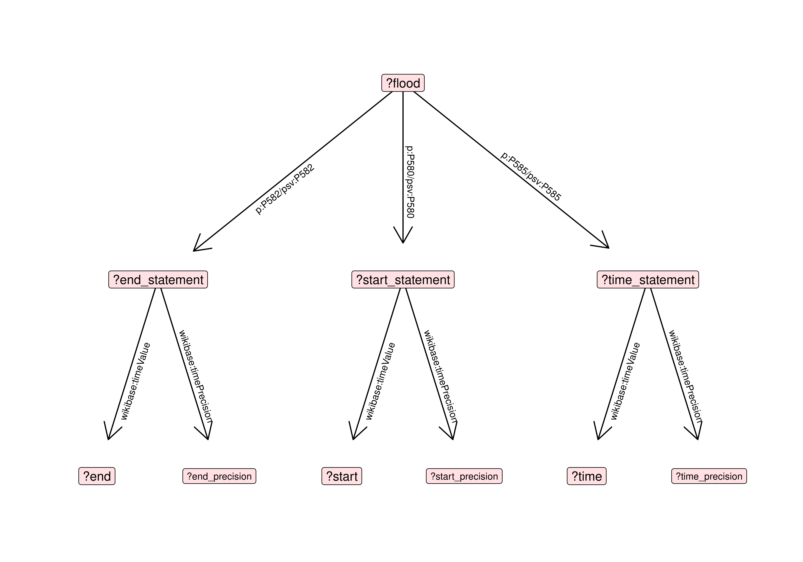
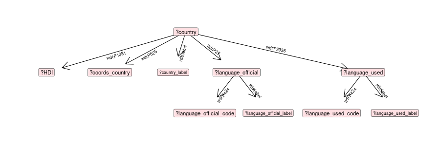
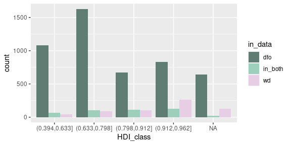
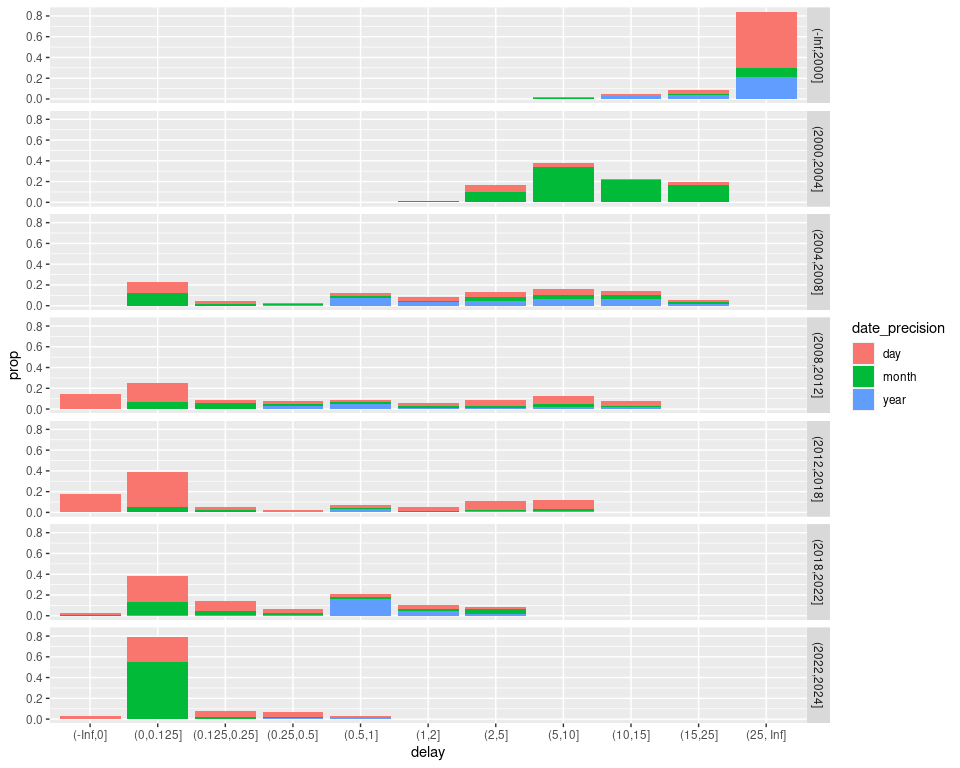
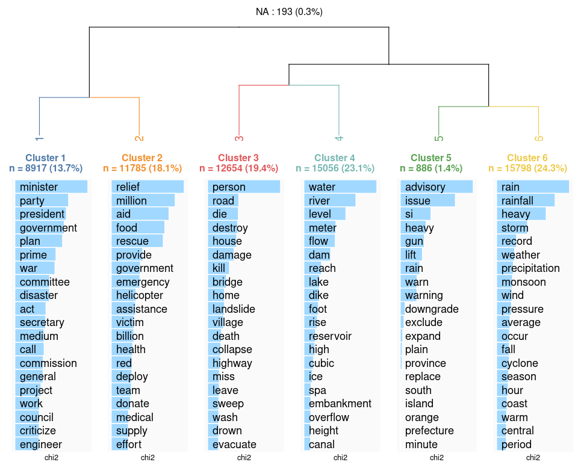
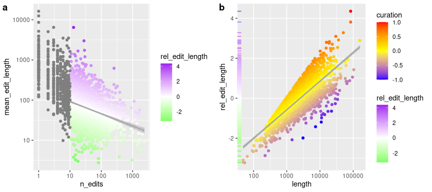
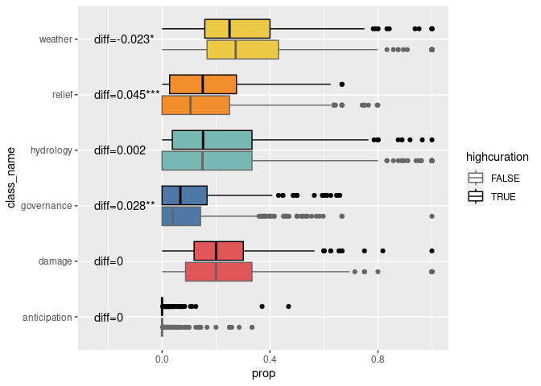
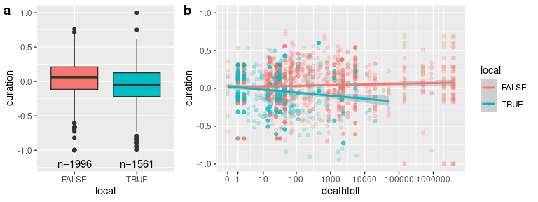

Lise VaudorLiolia BajemonMaïlys GenouëlHervé Piégay

# Online reports and narrations of flood events

# Aim of the article

This study’s objectives are to

1.  collect and assess the information provided by the Wikimedia
    initiative (Wikidata, Wikipedia, Wikimedia Commons) on flood events.
2.  compare this data, which is crowdsourced, to an institutionnally
    curated database on the same topic.
3.  use this data to characterize and understand (in terms of human
    impact especially) the flood events documented.

# Introduction

Producing a global flood event dataset poses numerous challenges due to
the complex nature of data semantics, collection, standardization, and
accessibility. A primary obstacle is the lack of uniform reporting
standards leading to inconsistencies in definitions of flood events and
in data collection methods. Varying technological capabilities (material
access and practice’s acculturation) across geographical regions of the
world also contribute to disparities in data availability. Disasters
like floods might occur in areas where communication and infrastructure
are limited, and/or not used for real-time data collection. Political,
social, and economic factors also play a role, as some regions may
under-report or document flood occurrences differently, due to reasons
such as insufficient resources and infrastructures, lack of governmental
transparency, or competing priorities \[add ref\]. Additionally, there
are inequalities in the geographies of data production that reflect and
reproduce global economic core-peripheries (Graham 2014; Graham, De
Sabbata, and Zook 2015; Haklay 2016). \[Ash et al. ref\] refers to some
“informational magnetism” resulting in the over-representation of the
global North (the “core”). As a result, and despite advancements in
satellite technology and remote sensing, ensuring comprehensive,
accurate, and up-to-date global flood data remains a persistent
challenge that requires better data curation; global efforts to improve
information-sharing mechanisms; and the development of a critical eye on
the reasons for data production, on the geographical contexts in which
it has been produced, and on its uses.

Participatory data collection can significantly enhance the
understanding and management of flood events. This approach involves
engaging local communities, citizens, and grassroots organizations in
the collection, analysis, and sharing of data related to flood
occurrences. Examples of such initiatives show the potential of
participatory data to complement institutional data about floods at a
local scale (Dixon, Johns, and Fernandez 2021; Sekajugo et al. 2022). By
incorporating local knowledge, experiences, and observations,
participatory methods complement traditional data sources, offering
valuable insights into flood-prone areas that might be overlooked by
centralized or remote monitoring systems, controlled by certain systems
in power (Nation-states, heterogeneous coalition of technologically
savvy individuals, private technology companies). More broadly,
volunteered geographical data at a local scale has been shown to be a
valuable source of data regarding hazards (Herfort et al. 2021).

Communities living in flood-prone regions possess unique,
context-specific, even vernacular knowledge about local environmental
changes, historical flood memory, vulnerable areas, and coping
mechanisms. Engaging these communities in data collection through
citizen science initiatives, mobile applications, community mapping, or
participatory workshops allows for the collection of granular, real-time
information that supplements existing datasets. Ideally, this bottom-up
approach not only enhances the accuracy and granularity of flood data,
but also fosters community empowerment in terms of resilience, by
engaging all communities to participate, including those excluded from
decision-making or digital access.

Moreover, participatory data can bridge gaps in official reporting by
capturing small-scale or localized flood events that are not publicized
and thus recognized by institutions. Integrating participatory data with
conventional datasets enables a more comprehensive understanding of
flood dynamics, aiding in the development of anticipation policies
effective early warning systems, and disaster response plans.

However, challenges such as ensuring data accuracy, reliability, and
standardization persist in participatory approaches. While establishing
protocols for data validation and quality control between participatory
and formal datasets is important to maximize the potential of
participatory data and to maintain data integrity (Senaratne et al.
2017), the participatory data can be standardized. In other words, the
subtelties perceived by local communities can be smoothed out (i) in
interfaces designed by situated engineers and (ii) in data collection
via protocols designed by situated scientists. However, the stakes
around data validation and homogenization are particularly high in the
prospect of studying floods at a global scale.

Overall, leveraging participatory data in conjunction with conventional
methods can enrich global flood databases, improve resilience, and
empower communities to better respond to and mitigate the impacts of
flood events. This collaborative approach can contribute significantly
to more holistic and inclusive strategies for managing floods worldwide,
to question (i) the data (how, by whom and for what purpose they are
collected) and (ii) the collection process (highlighting ethnocentric
biases by comparison).

The Dartmouth Flood Observatory (DFO) is a research group specializing
in the collection and analysis of global flood data. Combining remote
sensing and news reports’ analysis, the DFO produces detailed
information on the extent, frequency, and impacts of floods worldwide
(Kundzewicz, Pińskwar, and Brakenridge 2013). It constitutes an
invaluable source of information on the subject, used in many scientific
studies on flood events (Winsemius et al. 2013; Hu et al. 2018; Najibi
and Devineni 2018; Tellman et al. 2021).

In parallel to that kind of research-related, expert database on the
subject, the Wikimedia project stands as a remarkable source of
structured or semi-structured participatory data with its vast array of
user-generated content across platforms like Wikipedia, Wikidata, and
Wikimedia Commons. Wikipedia, as one of the largest collaborative
encyclopedias, and one of the most used and visited websites globally
(Graham, De Sabbata, and Zook 2015; Ballatore, Graham, and Sen 2017)
harnesses the collective knowledge of volunteers worldwide who
contribute, edit, and curate articles on diverse subjects, including
geographical features, history, and environmental events such as floods.
It can be viewed both as a source of breaking news and as an
encyclopedia, providing information and narrative regarding ongoing and
past events, in particular crises and controversies (Moats 2019).
Wikidata, an open database, provides structured data that can be used to
categorize and link information, potentially cataloging flood events,
affected regions, and relevant details. Wikimedia Commons serves as a
repository for multimedia files, housing images, maps, and other visual
resources related to floods, contributing to a more comprehensive
understanding of such events. The open nature of Wikimedia projects
allows for continual updates and contributions, making it a valuable
resource for researchers, policymakers, and the public seeking
information on various topics, including flood events, across the globe.
The Wikimedia projects are an example of user-generated content on web
2.0 (O’Reilly 2020). Moreover, flood events are generally associated
with a location or toponymic information: as such, the produced data can
also be included in what Goodchild (2007) calls “volunteered geographic
information” (VGI).

Wikipedia articles have been studied in the context of managing crises
due to its accessibility, comprehensiveness, and real-time updates,
either focusing on content creation or consultation. This has been the
case for e.g. epidemiologic crises (Van Velsen et al. 2012; Colavizza
2020), natural disasters, technological accidents and violent conflict
(Keegan, Gergle, and Contractor 2013). During flood events, people might
seek immediate information regarding safety measures, evacuation
procedures, flood-prone areas, and emergency contacts. Wikipedia’s open
editing structure allows for rapid dissemination of accurate
information, enabling users to access critical details swiftly.
Moreover, the collaborative nature of Wikipedia ensures that a vast
array of perspectives and expertise contribute to its articles,
resulting in comprehensive coverage of flood-related topics, including
flood mitigation strategies, historical flood data, and relevant
government responses. This breadth of information empowers individuals,
communities, and organizations to make informed decisions and take
effective action in response to floods, ultimately aiding in crisis
management and mitigation efforts. Additionally, Wikipedia’s
multilingual support ensures that its resources are accessible to a
global audience, facilitating disaster response efforts in diverse
regions affected by floods.

Like many volunteered mapping platforms, the Wikimedia projects are
receiving growing interest from the research community (Farda-Sarbas and
Müller-Birn 2019). As such, they are used in various projects: on the
one hand, the content is employed directly as a data source, e.g. in
history, literacy studies, archeology, philosophy (Zhao 2023),
linguistics (Turki et al. 2017), medical and biological sciences
(Farda-Sarbas and Müller-Birn 2019; Burgstaller-Muehlbacher et al.
2016), etc. or as an indicator of public interest (Mittermeier et al.
2021). On the other hand, studies consider the Wikimedia projects as a
research object, e.g. analyzing the contributors’ motivations (Antin
2011), comparing their data to traditional databases (Lorini et al.
2020), evaluating completeness (Royal and Kapila 2009), accuracy (Giles
2005), topic coverage (Halavais and Lackaff 2008), local (Ballatore,
Graham, and Sen 2017; Ballatore and De Sabbata 2020) and global
distribution (Graham, De Sabbata, and Zook 2015; Graham et al. 2018),
analyzing knowledge construction (Oeberst et al. 2014) and social
network dynamics (Iba et al. 2010), etc. However, using a worldwide,
crowdsourced, open database implies characterizing its contributors.
Firstly, studies show that UGC is unequally distributed on a global
scale: it is generally skewed towards countries from the Global North,
whether it be in terms of participation, representation or access
(Graham et al. 2018; Graham, De Sabbata, and Zook 2015; Ballatore,
Graham, and Sen 2017). Research conducted on Wikipedia suggests that the
platform follows the same pattern. For example, Graham (2014) shows that
Europe and North America get the greatest number of articles per person.
Secondly, participation tends to be skewed towards “a more wealthy, more
educated, more Western, more white and more male demographic” (Crampton
et al. 2013, 132). For example, research on OpenStreetMap – an open and
crowdsourced mapping platform – suggests that it reproduces the
socio-economical structures (Bittner 2017). The risk is that these
crowdsourced platforms reproduce the inequalities, leaving economically
and socially deprived areas also digitally deprived (Mashhadi,
Quattrone, and Capra 2015). There is also a strong gender asymmetry on
the web, contributing to biased data (Stephens 2013; Gardner et al.
2020).  
Identifying the data distribution is capital for interpretation and
analysis, given that the Wikimedia projects are a part of UGC and are
therefore subjects to its biases. The question “who produces the data?”
must then be addressed. Lorini et al. (2020) studied the report of
floods on Wikipedia. However, to our knowledge, no study using multiple
Wikimedia projects and analyzing the data distribution and production in
time as well as in space, using quantitative and textometric methods,
has been conducted on this subject.

# Methods

### Primary census of flood events

We collected Wikidata about floods, using the glitter R package (an
API-client to the Wikidata SPARQL endpoint API) (Vaudor and Salmon
2023).

We carried out a first Wikidata query to get all instances of floods or
subclasses of floods as well as a few descriptors of these. The events
can be located through `coords` (geographical coordinates) `loc` (a
location -which can be any type of geographical item documented in
Wikidata, e.g. a city, region or country- which in turn might provide
coordinates-), or simply through the `country` variable -which might
also in turn provide coordinates-). We used all these variables to try
and provide coordinates for as many events as possible, with the
greatest precision possible: we prioritized coords (when available) over
coordinates corresponding to location, and coordinates corresponding to
location (when available) to coordinates corresponding to country.

We carried out a second Wikidata query for each flood listed by this
first query, to gather information about its time of occurrence
(wdt:P585), start time (wdt:P580) and end time (wdt:P582). We hence
tried to provide a date for each of the events using either one of these
informations, prioritizing the date provided by time of occurrence (if
available) over the average date between start time and end time (if
both were available), average date between start time and end time over
start time or end time (if only one was available), and start time or
end time over four-digit words in the events’ label if present (as
labels generally consist of a mention of type of event, time and place).
Time-related information on Wikidata are specified with varying
precision, which when regarding floods generally vary between dayly
precision and yearly precision.

We carried out a third Wikidata query for each country listed by the
first query, to gather information about their coordinates, the
languages used by their population (either official or used languages),
and Human Development Index (HDI) \[ref\].

### Comparison to the Dartmouth Flood Observatory data

We wanted to confront the data about floods documented through Wikidata
(WD) to the data gathered by the Dartmouth Flood Observatory (DFO)
(Brakenridge n.d.). We downloaded the DFO dataset and curated it to make
it more easily comparable to our WD dataset, especially regarding
country labels. We then tried to match each event in WD to one event in
DFO through the following algorithm

For each WD event `flood`:

-   calculate the difference in time between DFO events and `flood`
-   calculate the distance between DFO events and `flood`
-   check for all DFO events whether the difference in time to `flood`
    is less than 400 days and the distance to `flood` is less than 400
    kms (condition 1)
-   check for all DFO events whether the difference in time to `flood`
    is less than 400 days and the countries of occurrence are the same
    than one of the countries registered for `flood` (condition 2)
-   filter all DFO events to only keep those verifying condition 1 or
    condition 2
-   if several DFO events verify those conditions, retain only the one
    corresponding to lowest difference in time to `flood`, and consider
    that this is the DFO event that matches `flood`

## Text analysis of Wikipedia pages

We scraped the text (all the textual content in headers from level one
(h1) to level 6 (h6) as well as paragraphs) from all listed Wikipedia
pages, using the `rvest` R package (Wickham 2024). We then translated
them to English (if necessary) through Google Translate using the
polyglotr R package (Iwan 2024).

We tokenized the texts with the tidytext R package (Silge and Robinson
2016), lemmatized words and filtered out stop words based on the
Iramuteq English dictionnary (Ratinaud 2009). We could then identify
textual specificities based on various partitions of the corpus (Lafon,
Pierre 1980; Loiseau et al. 2022).

We used Reinert’s method (Reinert 1990) to classify segments of our
corpus (consisting in successive parts of the Wikipedia articles,
segmented in such a way that each contains 10 lemmatized, content
words). To implement that method, we used the rainette package (Barnier
2023) and used its exploration tools to choose a meaningful and
tractable number of classes. Each class is characterized as a collection
of over-represented words, and we used them to label each class in a
one-worded, synthetic way. We then used these labelled classes to
examine the relationship between the flood characteristics and the topic
contents of articles.

# Results

## Online app

The results and tables can be consulted here:

<a href="https://isig-apps.ens-lyon.fr/apps/lvaudor/glourb_floods_app/"
target="_blank">link to app</a>

The app provides maps and plots regarding all events (i.e. at the global
scale) but also displays, for each event in the database, all the raw
data included in the analyses.

## Datasets

We have gathered and curated tables of data organized as follows:

### wd_events

<table>
<thead>
<tr class="header">
<th style="text-align: left;">var</th>
<th style="text-align: left;">key</th>
<th style="text-align: left;">class</th>
<th style="text-align: right;">n_distinct</th>
<th style="text-align: left;">example</th>
</tr>
</thead>
<tbody>
<tr class="odd">
<td style="text-align: left;">flood</td>
<td style="text-align: left;">*</td>
<td style="text-align: left;">character</td>
<td style="text-align: right;">792</td>
<td style="text-align: left;">wd:Q18991372</td>
</tr>
<tr class="even">
<td style="text-align: left;">flood_label</td>
<td style="text-align: left;"></td>
<td style="text-align: left;">character</td>
<td style="text-align: right;">698</td>
<td style="text-align: left;">1966 Kaetsu flood</td>
</tr>
<tr class="odd">
<td style="text-align: left;">date</td>
<td style="text-align: left;"></td>
<td style="text-align: left;">Date</td>
<td style="text-align: right;">615</td>
<td style="text-align: left;">1966-07-17</td>
</tr>
<tr class="even">
<td style="text-align: left;">country</td>
<td style="text-align: left;"></td>
<td style="text-align: left;">character</td>
<td style="text-align: right;">154</td>
<td style="text-align: left;">wd:Q17</td>
</tr>
<tr class="odd">
<td style="text-align: left;">country_label</td>
<td style="text-align: left;"></td>
<td style="text-align: left;">character</td>
<td style="text-align: right;">154</td>
<td style="text-align: left;">Japan</td>
</tr>
<tr class="even">
<td style="text-align: left;">year</td>
<td style="text-align: left;"></td>
<td style="text-align: left;">numeric</td>
<td style="text-align: right;">236</td>
<td style="text-align: left;">1966</td>
</tr>
</tbody>
</table>

### wp_pages

<table>
<colgroup>
<col style="width: 8%" />
<col style="width: 1%" />
<col style="width: 4%" />
<col style="width: 5%" />
<col style="width: 79%" />
</colgroup>
<thead>
<tr class="header">
<th style="text-align: left;">var</th>
<th style="text-align: left;">key</th>
<th style="text-align: left;">class</th>
<th style="text-align: right;">n_distinct</th>
<th style="text-align: left;">example</th>
</tr>
</thead>
<tbody>
<tr class="odd">
<td style="text-align: left;">flood</td>
<td style="text-align: left;"></td>
<td style="text-align: left;">character</td>
<td style="text-align: right;">727</td>
<td style="text-align: left;">wd:Q524797</td>
</tr>
<tr class="even">
<td style="text-align: left;">article</td>
<td style="text-align: left;">*</td>
<td style="text-align: left;">character</td>
<td style="text-align: right;">2630</td>
<td
style="text-align: left;">https://uk.wikipedia.org/wiki/%D0%9F%D0%BE%D0%B2%D1%96%D0%B4%D1%8C_%D0%A1%D0%B2%D1%8F%D1%82%D0%BE%D1%97_%D0%84%D0%BB%D0%B8%D0%B7%D0%B0%D0%B2%D0%B5%D1%82%D0%B8_(1421)</td>
</tr>
<tr class="odd">
<td style="text-align: left;">lang</td>
<td style="text-align: left;"></td>
<td style="text-align: left;">character</td>
<td style="text-align: right;">122</td>
<td style="text-align: left;">uk</td>
</tr>
<tr class="even">
<td style="text-align: left;">title</td>
<td style="text-align: left;"></td>
<td style="text-align: left;">character</td>
<td style="text-align: right;">2544</td>
<td style="text-align: left;">Повідь Святої Єлизавети (1421)</td>
</tr>
<tr class="odd">
<td style="text-align: left;">translated_title</td>
<td style="text-align: left;"></td>
<td style="text-align: left;">character</td>
<td style="text-align: right;">2067</td>
<td style="text-align: left;">Leash of Saint Elizabeth (1421)</td>
</tr>
<tr class="even">
<td style="text-align: left;">text</td>
<td style="text-align: left;"></td>
<td style="text-align: left;">character</td>
<td style="text-align: right;">2614</td>
<td style="text-align: left;">Повідь Святої Єлизавети (нід.
Sint-Elisabethsvloed, 18 листопада — 19 листопада 1421 року; також Дру…
[truncated]</td>
</tr>
<tr class="odd">
<td style="text-align: left;">textt</td>
<td style="text-align: left;"></td>
<td style="text-align: left;">character</td>
<td style="text-align: right;">2447</td>
<td style="text-align: left;">St. Elizabeth’s Leash
(n. Sint-Elisabethsvloed, 18 November – 19 November 1421; also Second
St. Eliz… [truncated]</td>
</tr>
<tr class="even">
<td style="text-align: left;">length</td>
<td style="text-align: left;"></td>
<td style="text-align: left;">numeric</td>
<td style="text-align: right;">1999</td>
<td style="text-align: left;">1483</td>
</tr>
<tr class="odd">
<td style="text-align: left;">local</td>
<td style="text-align: left;"></td>
<td style="text-align: left;">logical</td>
<td style="text-align: right;">2</td>
<td style="text-align: left;">FALSE</td>
</tr>
</tbody>
</table>

### wp_revisions

<table>
<colgroup>
<col style="width: 10%" />
<col style="width: 4%" />
<col style="width: 10%" />
<col style="width: 11%" />
<col style="width: 62%" />
</colgroup>
<thead>
<tr class="header">
<th style="text-align: left;">var</th>
<th style="text-align: left;">key</th>
<th style="text-align: left;">class</th>
<th style="text-align: right;">n_distinct</th>
<th style="text-align: left;">example</th>
</tr>
</thead>
<tbody>
<tr class="odd">
<td style="text-align: left;">article</td>
<td style="text-align: left;">*</td>
<td style="text-align: left;">character</td>
<td style="text-align: right;">2790</td>
<td
style="text-align: left;">https://eu.wikipedia.org/wiki/2010eko_Pakistango_uholdeak</td>
</tr>
<tr class="even">
<td style="text-align: left;">id</td>
<td style="text-align: left;"></td>
<td style="text-align: left;">integer</td>
<td style="text-align: right;">195484</td>
<td style="text-align: left;">1688053</td>
</tr>
<tr class="odd">
<td style="text-align: left;">timestamp</td>
<td style="text-align: left;"></td>
<td style="text-align: left;">character</td>
<td style="text-align: right;">192838</td>
<td style="text-align: left;">2010-09-03T06:02:23Z</td>
</tr>
<tr class="even">
<td style="text-align: left;">minor</td>
<td style="text-align: left;"></td>
<td style="text-align: left;">logical</td>
<td style="text-align: right;">3</td>
<td style="text-align: left;">TRUE</td>
</tr>
<tr class="odd">
<td style="text-align: left;">size</td>
<td style="text-align: left;"></td>
<td style="text-align: left;">integer</td>
<td style="text-align: right;">61689</td>
<td style="text-align: left;">3619</td>
</tr>
<tr class="even">
<td style="text-align: left;">comment</td>
<td style="text-align: left;"></td>
<td style="text-align: left;">character</td>
<td style="text-align: right;">94509</td>
<td style="text-align: left;">robota Erantsia: [[fa:سیل پاکستان
(۲۰۱۰)]]</td>
</tr>
<tr class="odd">
<td style="text-align: left;">delta</td>
<td style="text-align: left;"></td>
<td style="text-align: left;">integer</td>
<td style="text-align: right;">7182</td>
<td style="text-align: left;">40</td>
</tr>
<tr class="even">
<td style="text-align: left;">user_id</td>
<td style="text-align: left;"></td>
<td style="text-align: left;">integer</td>
<td style="text-align: right;">25752</td>
<td style="text-align: left;">15795</td>
</tr>
<tr class="odd">
<td style="text-align: left;">user_name</td>
<td style="text-align: left;"></td>
<td style="text-align: left;">character</td>
<td style="text-align: right;">44109</td>
<td style="text-align: left;">EmausBot</td>
</tr>
</tbody>
</table>

### wp_segments

<table>
<colgroup>
<col style="width: 5%" />
<col style="width: 1%" />
<col style="width: 4%" />
<col style="width: 5%" />
<col style="width: 83%" />
</colgroup>
<thead>
<tr class="header">
<th style="text-align: left;">var</th>
<th style="text-align: left;">key</th>
<th style="text-align: left;">class</th>
<th style="text-align: right;">n_distinct</th>
<th style="text-align: left;">example</th>
</tr>
</thead>
<tbody>
<tr class="odd">
<td style="text-align: left;">article</td>
<td style="text-align: left;">*</td>
<td style="text-align: left;">character</td>
<td style="text-align: right;">2630</td>
<td
style="text-align: left;">https://de.wikipedia.org/wiki/Februarflut_1825</td>
</tr>
<tr class="even">
<td style="text-align: left;">text_all</td>
<td style="text-align: left;"></td>
<td style="text-align: left;">character</td>
<td style="text-align: right;">64198</td>
<td style="text-align: left;">dike on the ostland which was not yet
connected to the western part of the island broke so that the entire
agricultural area there was flooded on juist there were also large
dune</td>
</tr>
<tr class="odd">
<td style="text-align: left;">text_sig</td>
<td style="text-align: left;"></td>
<td style="text-align: left;">character</td>
<td style="text-align: right;">64147</td>
<td style="text-align: left;">dike connect western part island break
entire area large dune</td>
</tr>
<tr class="even">
<td style="text-align: left;">class</td>
<td style="text-align: left;"></td>
<td style="text-align: left;">factor</td>
<td style="text-align: right;">7</td>
<td style="text-align: left;">class_4</td>
</tr>
<tr class="odd">
<td style="text-align: left;">class_name</td>
<td style="text-align: left;"></td>
<td style="text-align: left;">factor</td>
<td style="text-align: right;">7</td>
<td style="text-align: left;">hydrology</td>
</tr>
<tr class="even">
<td style="text-align: left;">color</td>
<td style="text-align: left;"></td>
<td style="text-align: left;">character</td>
<td style="text-align: right;">7</td>
<td style="text-align: left;">#76B7B2</td>
</tr>
</tbody>
</table>

### countries

<table>
<thead>
<tr class="header">
<th style="text-align: left;">var</th>
<th style="text-align: left;">key</th>
<th style="text-align: left;">class</th>
<th style="text-align: right;">n_distinct</th>
<th style="text-align: left;">example</th>
</tr>
</thead>
<tbody>
<tr class="odd">
<td style="text-align: left;">country</td>
<td style="text-align: left;">*</td>
<td style="text-align: left;">character</td>
<td style="text-align: right;">110</td>
<td style="text-align: left;">wd:Q29</td>
</tr>
<tr class="even">
<td style="text-align: left;">country_label</td>
<td style="text-align: left;">*</td>
<td style="text-align: left;">character</td>
<td style="text-align: right;">110</td>
<td style="text-align: left;">Spain</td>
</tr>
<tr class="odd">
<td style="text-align: left;">coords_country</td>
<td style="text-align: left;"></td>
<td style="text-align: left;">character</td>
<td style="text-align: right;">110</td>
<td style="text-align: left;">Point(-3.5 40.2)</td>
</tr>
<tr class="even">
<td style="text-align: left;">HDI</td>
<td style="text-align: left;"></td>
<td style="text-align: left;">numeric</td>
<td style="text-align: right;">101</td>
<td style="text-align: left;">0.905</td>
</tr>
<tr class="odd">
<td style="text-align: left;">lang_type</td>
<td style="text-align: left;"></td>
<td style="text-align: left;">character</td>
<td style="text-align: right;">2</td>
<td style="text-align: left;">used</td>
</tr>
<tr class="even">
<td style="text-align: left;">language</td>
<td style="text-align: left;"></td>
<td style="text-align: left;">character</td>
<td style="text-align: right;">442</td>
<td style="text-align: left;">Basque</td>
</tr>
<tr class="odd">
<td style="text-align: left;">language_code</td>
<td style="text-align: left;"></td>
<td style="text-align: left;">character</td>
<td style="text-align: right;">441</td>
<td style="text-align: left;">eu</td>
</tr>
</tbody>
</table>

## Wikidata on floods

The initial query provided **1018 Wikidata flood events**. In terms of
spatial precision, most coordinates are inferred from either variable
country or variable location (the major part of provided locations being
countries too). The date of most events is documented either directly or
through the label of the event. Most events’ dates are provided with day
precision but an important proportion (about one third) is provided with
only annual precision.

<table>
<thead>
<tr class="header">
<th style="text-align: left;">coords_from</th>
<th style="text-align: left;">is_country</th>
<th style="text-align: right;">n</th>
</tr>
</thead>
<tbody>
<tr class="odd">
<td style="text-align: left;">1) direct</td>
<td style="text-align: left;"></td>
<td style="text-align: right;">11</td>
</tr>
<tr class="even">
<td style="text-align: left;">2) location</td>
<td style="text-align: left;">no</td>
<td style="text-align: right;">189</td>
</tr>
<tr class="odd">
<td style="text-align: left;">2) location</td>
<td style="text-align: left;">yes</td>
<td style="text-align: right;">495</td>
</tr>
<tr class="even">
<td style="text-align: left;">3) country</td>
<td style="text-align: left;"></td>
<td style="text-align: right;">17</td>
</tr>
<tr class="odd">
<td style="text-align: left;">4) no coordinates</td>
<td style="text-align: left;"></td>
<td style="text-align: right;">86</td>
</tr>
</tbody>
</table>

<table>
<thead>
<tr class="header">
<th style="text-align: left;">date_from</th>
<th style="text-align: left;">date_precision</th>
<th style="text-align: right;">n</th>
</tr>
</thead>
<tbody>
<tr class="odd">
<td style="text-align: left;">av_start_end</td>
<td style="text-align: left;">day</td>
<td style="text-align: right;">145</td>
</tr>
<tr class="even">
<td style="text-align: left;">direct</td>
<td style="text-align: left;">day</td>
<td style="text-align: right;">224</td>
</tr>
<tr class="odd">
<td style="text-align: left;">direct</td>
<td style="text-align: left;">month</td>
<td style="text-align: right;">122</td>
</tr>
<tr class="even">
<td style="text-align: left;">direct</td>
<td style="text-align: left;">year</td>
<td style="text-align: right;">107</td>
</tr>
<tr class="odd">
<td style="text-align: left;">flood_label</td>
<td style="text-align: left;">year</td>
<td style="text-align: right;">138</td>
</tr>
<tr class="even">
<td style="text-align: left;">start</td>
<td style="text-align: left;">day</td>
<td style="text-align: right;">45</td>
</tr>
<tr class="odd">
<td style="text-align: left;">NA</td>
<td style="text-align: left;">NA</td>
<td style="text-align: right;">31</td>
</tr>
</tbody>
</table>

## Compare to DFO data

We compare the number of events in both datasets (WD and DFO) according
to Human Development Index of the country where the event took place.

[Figure 2](#fig-HDI_deathtoll_data) shows that events in Wikidata are
generally associated with higher deathtoll compared to those documented
in DFO only or DFO and WD both. For DFO-documented events, the lower the
HDI class, the higher the deathtoll, while for WD-documented events, the
few events which occurred in lowest HDI countries also correspond to
(very) high deathtolls indeed, but so do the ones which have occurred in
the richest countries. *(and I don’t quite know how to explain that…
maybe a tendency to overestimation or to consider “far-reaching”
consequences?)*

## Wikipedia on floods

There are **2630 Wikipedia pages** associated to these events (i.e. on
average 2.58 Wikipedia pages per event). 727 flood events are associated
to at least one Wikipedia page.

455 Wikipedia pages are in English. Out of the 2175 remaining pages, we
could translate most pages to English, except 175 pages which were in
languages that Google Translate did not support. We based all subsequent
textometric analyses on the texts in English, either natively so or
translated.

The average length of articles (in English or translated to English) is
4348 characters. The 10% shortest articles represent less than 448
characters and the 10% longest ones are more than 9362 characters long.

There are **216245 revisions** that produced the Wikipedia pages as they
appear to this date, which represents an average 82 revisions per page.
175107 (80.98%) of these revisions appear to have been done by human
editors and not bots (Wikipedia usernames do not contain the strings
“bot” or “Bot”). There are **44109 distinct editors**, 40101 (90.91%) of
which appear to be humans. On average, each human editor in our corpus
is responsible for 4.37 edits. The number of articles (in the corpus)
edited by each human editor is distributed as follows:

<table>
<thead>
<tr class="header">
<th style="text-align: left;">number_of_articles_edited</th>
<th style="text-align: right;">number_of_editors</th>
<th style="text-align: right;">proportion_of_editors</th>
</tr>
</thead>
<tbody>
<tr class="odd">
<td style="text-align: left;">(0,1]</td>
<td style="text-align: right;">27372</td>
<td style="text-align: right;">68.26</td>
</tr>
<tr class="even">
<td style="text-align: left;">(1,2]</td>
<td style="text-align: right;">8396</td>
<td style="text-align: right;">20.94</td>
</tr>
<tr class="odd">
<td style="text-align: left;">(2,5]</td>
<td style="text-align: right;">2976</td>
<td style="text-align: right;">7.42</td>
</tr>
<tr class="even">
<td style="text-align: left;">(5,10]</td>
<td style="text-align: right;">862</td>
<td style="text-align: right;">2.15</td>
</tr>
<tr class="odd">
<td style="text-align: left;">(10,100]</td>
<td style="text-align: right;">487</td>
<td style="text-align: right;">1.21</td>
</tr>
<tr class="even">
<td style="text-align: left;">(100,400]</td>
<td style="text-align: right;">8</td>
<td style="text-align: right;">0.02</td>
</tr>
</tbody>
</table>

## Wikipedia history, topics and curation

[Figure 3](#fig-delay_revisions) shows that most of the writing of
Wikipedia articles related to flood events take place during the month
of their occurrence (except of course when Wikipedia did not exist
(before 2001) or when it was still moderately used to document current
events. This highlights the fact that Wikipedia articles about recent
flood events can be viewed as news rather than encyclopedic reports on
past events. Conversely, one can argue that articles exhibiting a large
proportion of revisions implemented a long time after the occurrence of
the event could be indicative of an ongoing debate or controversy, or be
the ongoing focus of some social or human interest. *Notez que je ne
l’ai pas fait pour l’instant car je croule déjà sous les données, mais
il serait possible (et pas trop compliqué) de récupérer les statistiques
de consultation de chacune des pages (et donc de considérer l’intérêt
porté à un article du point de vue du lecteur plutôt que du point de vue
du créateur de contenu…). Est-ce que vous pensez que je dois me lancer
là-dedans?*

[Figure 5](#fig-topic_per_length) shows that the length of the article
is probably a very important factor in the topics addressed (or
conversely, the topics addressed determine the length of the article),
with shorter articles corresponding to factual statements regarding
physical features of the event (weather), and justifying reporting that
event based on its consequences (damage), while longer articles might
convey more extensive reports on the physical causes (hydrology) and
management of the crisis (anticipation, governance, relief).

[Figure 6](#fig-curation) .a shows that beyond a few edits (here, we
consider the threshold is 10), the mean edit length for an article
depends on the total number of edits for that same article, in an
approximately linear relationship with both variables being
log-transformed. The more edits a page has undergone, the lower the mean
edit length: there is a tendency towards lower mean edit length as the
page ‘matures’, with edits in a more advanced writing stage
corresponding to suppressions, corrections, or slight modifications
while edits at the beginning of the writing process tend to be more
frequently text additions. We consider the difference between actual
mean edit length edit and predicted mean edit length (based on number of
edits) as a measure of relative edit length (it corresponds to a measure
of mean edit length decorrelated from this previously described writing
stage effect). By construction and as shown by [Figure 6](#fig-curation)
.b, the relative edit length is highly correlated to total article
length, though we would like to dispose of a length-independent curation
measure for further analyses purposes. Hence we calculate the curation
score based on the residuals of the linear relationship of the relative
edit length to total length (both log-transformed). These residuals are
normalized to correspond to scores ranging from -1 (rather lowly curated
articles) to 1 (very highly curated articles). We argue that this could
be used as a measure of a particular effort having been devoted to the
establishment of the current text and could thus be interpreted as a
sign of possible controversy or debate in its writing process.

[Figure 7](#fig-curation_topics) shows that articles with high levels of
curation tend to deal with topics such as relief (diff=0.045***), and
governance (diff=0.028**), while weather (diff=-0.023*) is a bit less
addressed. This hints at relief and governance being sensitive topics,
which probably require and elicit more careful editing, discussion and
fact-checking than e.g. reports on weather.

[Figure 8](#fig-curation_causes) .a shows that the articles’ being
written in a local language (considering the event location) tends to be
associated with a lower level of article curation (effect estimate=
-0.084, t value=-10, Pr(\>|t|)=0). This could be due to local articles
being used more as information or managing crises tools than educational
or encyclopedic carefully curated sources of knowledge. This hypothesis
is reinforced by [Figure 8](#fig-curation_causes) .b which shows that
the higher the deathtoll of an event, the less curated the local
articles (slope for local articles -0.02, t value= -4.32,
Pr(\>|t|)=0.00002).

# Conclusion

This study demonstrates the possibility to list and collect information
on flood events on a large temporal and spatial scale through Wikidata,
Wikimedia and Wikipedia projects. Although these data exhibit some
heterogeneity (Lorini et al. 2020; Ruprechter, Burghardt, and Helic
2023) due to economic and digital inequities, being able to rely on a
preexistent, rich global dataset spanning a large time period is still a
priceless asset in studying floods, and could be a first step to
better-quality curated datasets. Besides, large-scale institutional data
sources themselves are not immune to spatial heterogeneities due to
scarcity of research activity in some areas, linguistic barriers,
varying degrees of public investment in disaster management, or other
sources of environmental, political and social inequities.

Linked Open Data such as Wikidata hold great interest for the study of
natural or social events due to their inherent ability to offer
contextual information to documented items. Linking semantically events
when they are documented in fundamentally different datasets (such as
DFO and Wikidata) might remain very difficult. Neverthelss, the
interconnected nature of Wikidata’s model (as a knowledge graph) as well
as their link to other data silos in the Linked Open Data framework
allow users to easily access additional information or related resources
linked to a particular event. The present study hence demonstrates the
strength of such a data source to provide context on a global scale
(social, in particular) through the integration of Wikipedia discourse
elements.

Antin, Judd. 2011. “My Kind of People?: Perceptions about Wikipedia
Contributors and Their Motivations.” In *Proceedings of the SIGCHI
Conference on Human Factors in Computing Systems*, 3411–20. Vancouver BC
Canada: ACM. <https://doi.org/10.1145/1978942.1979451>.

Ballatore, Andrea, and Stefano De Sabbata. 2020. “Los Angeles as a
Digital Place: The Geographies of User‐generated Content.” *Transactions
in GIS* 24 (4): 880–902. <https://doi.org/10.1111/tgis.12600>.

Ballatore, Andrea, Mark Graham, and Shilad Sen. 2017. “Digital
Hegemonies: The Localness of Search Engine Results.” *Annals of the
American Association of Geographers* 107 (5): 1194–1215.
<https://doi.org/10.1080/24694452.2017.1308240>.

Barnier, Julien. 2023. *Rainette: The Reinert Method for Textual Data
Clustering*. <https://juba.github.io/rainette/>.

Bittner, Christian. 2017. “Diversity in Volunteered Geographic
Information: Comparing OpenStreetMap and Wikimapia in Jerusalem.”
*GeoJournal* 82 (5): 887–906.
<https://doi.org/10.1007/s10708-016-9721-3>.

Brakenridge, G. Robert. n.d. “Global Active Archive of Large Flood
Events.” Dartmouth Flood Observatory, University of Colorado, USA.
Accessed December 1, 2023.
<https://floodobservatory.colorado.edu/Archives/index.html>.

Burgstaller-Muehlbacher, Sebastian, Andra Waagmeester, Elvira Mitraka,
Julia Turner, Tim Putman, Justin Leong, Chinmay Naik, et al. 2016.
“Wikidata as a Semantic Framework for the Gene Wiki Initiative.”
*Database* 2016: baw015. <https://doi.org/10.1093/database/baw015>.

Colavizza, Giovanni. 2020. “COVID-19 Research in Wikipedia.”
*Quantitative Science Studies* 1 (4): 1349–80.
<https://doi.org/10.1162/qss_a_00080>.

Crampton, Jeremy W., Mark Graham, Ate Poorthuis, Taylor Shelton, Monica
Stephens, Matthew W. Wilson, and Matthew Zook. 2013. “Beyond the Geotag:
Situating ‘Big Data’ and Leveraging the Potential of the Geoweb.”
*Cartography and Geographic Information Science* 40 (2): 130–39.
<https://doi.org/10.1080/15230406.2013.777137>.

Dixon, Barnali, RebeccaA. Johns, and Amada Fernandez. 2021. “The Role of
Crowdsourced Data, Participatory Decision-Making and Mapping of Flood
Related Events.” *Applied Geography* 128 (March): 102393.
<https://doi.org/10.1016/j.apgeog.2021.102393>.

Farda-Sarbas, Mariam, and Claudia Müller-Birn. 2019. “Wikidata from a
Research Perspective – A Systematic Mapping Study of Wikidata.” arXiv.
<http://arxiv.org/abs/1908.11153>.

Gardner, Z., P. Mooney, S. De Sabbata, and L. Dowthwaite. 2020.
“Quantifying Gendered Participation in OpenStreetMap: Responding to
Theories of Female (Under) Representation in Crowdsourced Mapping.”
*GeoJournal* 85 (6): 1603–20.
<https://doi.org/10.1007/s10708-019-10035-z>.

Giles, Jim. 2005. “Internet Encyclopaedias Go Head to Head.” *Nature*
438 (7070): 900–901. <https://doi.org/10.1038/438900a>.

Goodchild, Michael F. 2007. “Citizens as Sensors: The World of
Volunteered Geography.” *GeoJournal* 69 (4): 211–21.
<https://doi.org/10.1007/s10708-007-9111-y>.

Graham, Mark. 2014. “Inequitable Distributions in Internet Geographies:
The Global South Is Gaining Access, but Lags in Local Content.”
*Innovations: Technology, Governance, Globalization* 9 (3-4): 3–19.
<https://doi.org/10.1162/inov_a_00212>.

Graham, Mark, Stefano De Sabbata, Ralph Straumann, and Sanna Ojanperä.
2018. “Uneven Digital Geographies … and Why They Matter.” In *Sozial-
Und Kulturgeographie*, edited by kollektiv orangotango+, 2nd ed.,
26:308–15. Bielefeld, Germany: transcript Verlag.
<https://doi.org/10.14361/9783839445198-041>.

Graham, Mark, Stefano De Sabbata, and Matthew A. Zook. 2015. “Towards a
Study of Information Geographies: (Im)mutable Augmentations and a
Mapping of the Geographies of Information.” *Geo: Geography and
Environment* 2 (1): 88–105. <https://doi.org/10.1002/geo2.8>.

Haklay, Mordechai (Muki). 2016. “Why Is Participation Inequality
Important?” In *European Handbook of Crowdsourced Geographic
Information*, Cristina Capineri, Muki Haklay, H Huang, Vyron Antoniou, J
Kettunen, F Ostermann, and R Purve, 35–44. London: Ubiquity Press.

Halavais, Alexander, and Derek Lackaff. 2008. “An Analysis of Topical
Coverage of Wikipedia.” *Journal of Computer-Mediated Communication* 13
(2): 429–40. <https://doi.org/10.1111/j.1083-6101.2008.00403.x>.

Herfort, Benjamin, Sven Lautenbach, João Porto De Albuquerque, Jennings
Anderson, and Alexander Zipf. 2021. “The Evolution of Humanitarian
Mapping Within the OpenStreetMap Community.” *Scientific Reports* 11
(1): 3037. <https://doi.org/10.1038/s41598-021-82404-z>.

Hu, Pan, Qiang Zhang, Peijun Shi, Bo Chen, and Jiayi Fang. 2018.
“Flood-Induced Mortality Across the Globe: Spatiotemporal Pattern and
Influencing Factors.” *Science of The Total Environment* 643 (December):
171–82. <https://doi.org/10.1016/j.scitotenv.2018.06.197>.

Iba, Takashi, Keiichi Nemoto, Bernd Peters, and Peter A. Gloor. 2010.
“Analyzing the Creative Editing Behavior of Wikipedia Editors.”
*Procedia - Social and Behavioral Sciences* 2 (4): 6441–56.
<https://doi.org/10.1016/j.sbspro.2010.04.054>.

Iwan, Tomer. 2024. *Polyglotr: Translate Text*.
<https://github.com/Tomeriko96/polyglotr/>.

Keegan, Brian, Darren Gergle, and Noshir Contractor. 2013. “Hot Off the
Wiki: Structures and Dynamics of Wikipedia’s Coverage of Breaking News
Events.” *American Behavioral Scientist* 57 (5): 595–622.
<https://doi.org/10.1177/0002764212469367>.

Kundzewicz, Zbigniew W., Iwona Pińskwar, and G. Robert Brakenridge.
2013. “Large Floods in Europe, 1985–2009.” *Hydrological Sciences
Journal* 58 (1): 1–7. <https://doi.org/10.1080/02626667.2012.745082>.

Lafon, Pierre. 1980. “Sur La Variabilité de La Fréquence Des Formes Dans
Un Corpus.” *Mots* 1 (1): 127–65.
<https://doi.org/10.3406/mots.1980.1008>.

Loiseau, Sylvain, Lise Vaudor, Matthieu Decorde, and Serge Heiden. 2022.
*Textometry: Textual Data Analysis Package Used by the TXM Software*.
<https://cran.r-project.org/web/packages/textometry/>.

Lorini, Valerio, Javier Rando, Diego Saez-Trumper, and Carlos Castillo.
2020. “Uneven Coverage of Natural Disasters in Wikipedia: The Case of
Flood.” <https://doi.org/10.48550/ARXIV.2001.08810>.

Mashhadi, Afra, Giovanni Quattrone, and Licia Capra. 2015. “The Impact
of Society on Volunteered Geographic Information: The Case of
OpenStreetMap.” In *OpenStreetMap in GIScience*, edited by Jamal Jokar
Arsanjani, Alexander Zipf, Peter Mooney, and Marco Helbich, 125–41.
Cham: Springer International Publishing.
<https://doi.org/10.1007/978-3-319-14280-7_7>.

Mittermeier, John C., Ricardo Correia, Rich Grenyer, Tuuli Toivonen, and
Uri Roll. 2021. “Using Wikipedia to Measure Public Interest in
Biodiversity and Conservation.” *Conservation Biology* 35 (2): 412–23.
<https://doi.org/10.1111/cobi.13702>.

Moats, David. 2019. “Following the Fukushima Disaster on (and Against)
Wikipedia: A Methodological Note about STS Research and Online
Platforms.” *Science, Technology, & Human Values* 44 (6): 938–64.
<https://doi.org/10.1177/0162243918815234>.

Najibi, Nasser, and Naresh Devineni. 2018. “Recent Trends in the
Frequency and Duration of Global Floods.” *Earth System Dynamics* 9 (2):
757–83. <https://doi.org/10.5194/esd-9-757-2018>.

O’Reilly, Tim. 2020. “4. What Is Web 2.0: Design Patterns and Business
Models for the Next Generation of Software.” In *The Social Media
Reader*, edited by Michael Mandiberg, 32–52. New York University Press.
<https://doi.org/10.18574/nyu/9780814763025.003.0008>.

Oeberst, Aileen, Iassen Halatchliyski, Joachim Kimmerle, and Ulrike
Cress. 2014. “Knowledge Construction in Wikipedia: A
Systemic-Constructivist Analysis.” *Journal of the Learning Sciences* 23
(2): 149–76. <https://doi.org/10.1080/10508406.2014.888352>.

Ratinaud, Pierre. 2009. “Iramuteq: Interface de R Pour Les Analyses
Multidimensionnelles de Textes Et de Questionnaires.”
<http://www.iramuteq.org>.

Reinert, Max. 1990. “Alceste Une Méthodologie d’analyse Des Données
Textuelles Et Une Application: Aurelia De Gerard De Nerval.” *Bulletin
of Sociological Methodology/Bulletin de Méthodologie Sociologique* 26
(1): 24–54. <https://doi.org/10.1177/075910639002600103>.

Royal, Cindy, and Deepina Kapila. 2009. “What’s on Wikipedia, and What’s
Not . . . ?: Assessing Completeness of Information.” *Social Science
Computer Review* 27 (1): 138–48.
<https://doi.org/10.1177/0894439308321890>.

Ruprechter, Thorsten, Keith Burghardt, and Denis Helic. 2023. “Poor
Attention: The Wealth and Regional Gaps in Event Attention and Coverage
on Wikipedia.” Edited by Robin Haunschild. *PLOS ONE* 18 (11): e0289325.
<https://doi.org/10.1371/journal.pone.0289325>.

Sekajugo, John, Grace Kagoro-Rugunda, Rodgers Mutyebere, Clovis
Kabaseke, Esther Namara, Olivier Dewitte, Matthieu Kervyn, and Liesbet
Jacobs. 2022. “Can Citizen Scientists Provide a Reliable
Geo-Hydrological Hazard Inventory? An Analysis of Biases, Sensitivity
and Precision for the Rwenzori Mountains, Uganda.” *Environmental
Research Letters* 17 (4): 045011.
<https://doi.org/10.1088/1748-9326/ac5bb5>.

Senaratne, Hansi, Amin Mobasheri, Ahmed Loai Ali, Cristina Capineri, and
Mordechai (Muki) Haklay. 2017. “A Review of Volunteered Geographic
Information Quality Assessment Methods.” *International Journal of
Geographical Information Science* 31 (1): 139–67.
<https://doi.org/10.1080/13658816.2016.1189556>.

Silge, Julia, and David Robinson. 2016. “Tidytext: Text Mining and
Analysis Using Tidy Data Principles in R.” *JOSS* 1 (3).
<https://doi.org/10.21105/joss.00037>.

Stephens, Monica. 2013. “Gender and the GeoWeb: Divisions in the
Production of User-Generated Cartographic Information.” *GeoJournal* 78
(6): 981–96. <https://doi.org/10.1007/s10708-013-9492-z>.

Tellman, B., J. A. Sullivan, C. Kuhn, A. J. Kettner, C. S. Doyle, G. R.
Brakenridge, T. A. Erickson, and D. A. Slayback. 2021. “Satellite
Imaging Reveals Increased Proportion of Population Exposed to Floods.”
*Nature* 596 (7870): 80–86.
<https://doi.org/10.1038/s41586-021-03695-w>.

Turki, Houcemeddine, Denny Vrandecic, Helmi Hamdi, and Imed Adel. 2017.
“Using WikiData as a Multi-Lingual Multi-Dialectal Dictionary for Arabic
Dialects.” In *2017 IEEE/ACS 14th International Conference on Computer
Systems and Applications (AICCSA)*, 437–42. Hammamet: IEEE.
<https://doi.org/10.1109/AICCSA.2017.115>.

Van Velsen, Lex, Julia E. W. C Van Gemert-Pijnen, Desirée J. M. A
Beaujean, Jobke Wentzel, and Jim E Van Steenbergen. 2012. “Should Health
Organizations Use Web 2.0 Media in Times of an Infectious Disease
Crisis? An In-Depth Qualitative Study of Citizens’ Information Behavior
During an EHEC Outbreak.” *Journal of Medical Internet Research* 14 (6):
e181. <https://doi.org/10.2196/jmir.2123>.

Vaudor, Lise, and Maëlle Salmon. 2023. *Glitter: Glitter Makes SPARQL*.
<https://lvaudor.github.io/glitter/>.

Wickham, Hadley. 2024. *Rvest: Easily Harvest (Scrape) Web Pages*.
<https://rvest.tidyverse.org/>.

Winsemius, H. C., L. P. H. Van Beek, B. Jongman, P. J. Ward, and A.
Bouwman. 2013. “A Framework for Global River Flood Risk Assessments.”
*Hydrology and Earth System Sciences* 17 (5): 1871–92.
<https://doi.org/10.5194/hess-17-1871-2013>.

Zhao, Fudie. 2023. “A Systematic Review of Wikidata in Digital
Humanities Projects.” *Digital Scholarship in the Humanities* 38 (2):
852–74. <https://doi.org/10.1093/llc/fqac083>.
